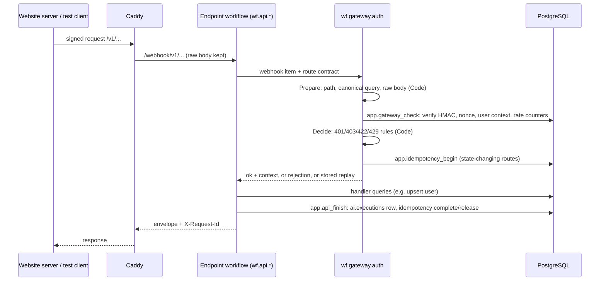

# Architecture (state after phase 1)

This file describes what exists. The target architecture is in FLATSHARE_BACKEND_SPEC.md
sections 5 and 8; deviations are in DECISIONS.md.

## Services (docker-compose.yml)

| Service | Role | Reachable from |
|---|---|---|
| `proxy` (Caddy) | Public entry: `/v1/*` → n8n production webhooks; envelopes n8n's own error answers; 1 MiB body limit | host 127.0.0.1:8080 |
| `n8n` + `n8n-runners` | All API logic: gateway, endpoints, error handler. Code nodes run in the external runner | proxy; editor on host 127.0.0.1:5678 |
| `postgres` | One server, two databases: `flatshare` (app, kb, ai, eval, sec schemas) and `n8n` (n8n's own data) | compose network |
| `garage` | S3-compatible object storage (bucket created at start) | compose network |
| `ollama` | Embeddings (bge-m3), later local LLMs and vision | compose network |
| one-shot: `db-bootstrap`, `n8n-setup`, `ollama-pull` | migrations, role passwords, settings, API keys; credential and workflow import; model pull | — |
| profiles: `queue` (Redis), `test` (test runner) | load tests later; contract tests | — |

Not built yet: ASR, Media, Text services (phase 4), 3D worker (phase 10), Telegram channel.

## Request path

Three or four database calls per request, all parameterised. Secrets never pass through n8n:
the HMAC is computed inside PostgreSQL by a function `n8n_worker` can call but whose key table it cannot read.

## Workflows (n8n/workflows, generated by n8n/build.py)

| Workflow | Trigger | Does |
|---|---|---|
| `wf.gateway.auth` | sub-workflow | signature, replay, rate limit, user, role, consent, body rules, idempotency |
| `wf.api.health` | `GET /v1/health` | database, object storage, Ollama + embedding model checks |
| `wf.api.users_sync` | `POST /v1/users/sync` | create/update user, consent status |
| `wf.ops.error_handler` | Error Trigger | records unexpected workflow failures in `ai.executions` |
| `wf.test.fail` | `GET /v1/test/fail` | test-only, throws; imported only with `N8N_IMPORT_TEST_WORKFLOWS=1` |

## Database roles

| Role | Used by | Can |
|---|---|---|
| `postgres` | migrations, bootstrap | everything |
| `n8n_app` | n8n itself | owns database `n8n` only |
| `n8n_worker` | workflows (credential "Flatshare DB (n8n_worker)") | CRUD on app/kb/ai/eval, bypasses RLS, calls `sec.verify_request`; cannot read `sec.api_clients` |
| `api_user` | reserved for a future API layer | RLS-limited reads and owner-limited writes; three functions |
| `sec_owner` | owns `sec.*` | no login |
