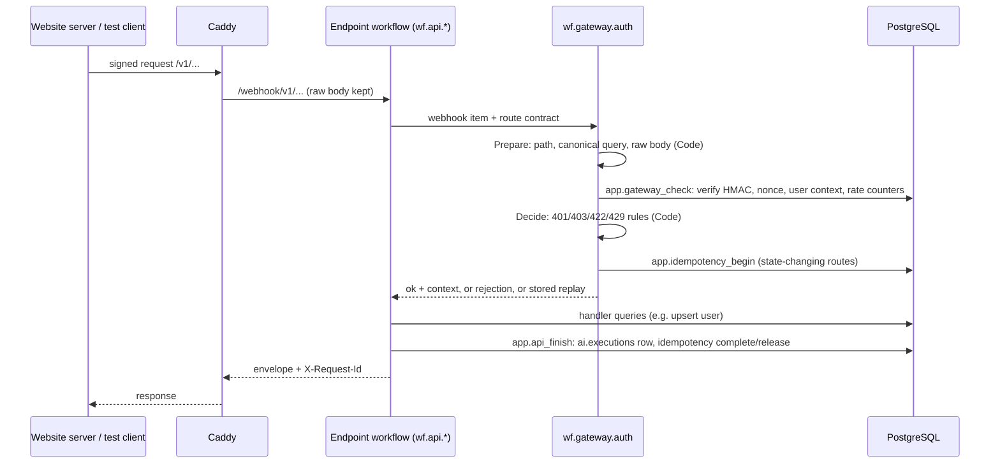
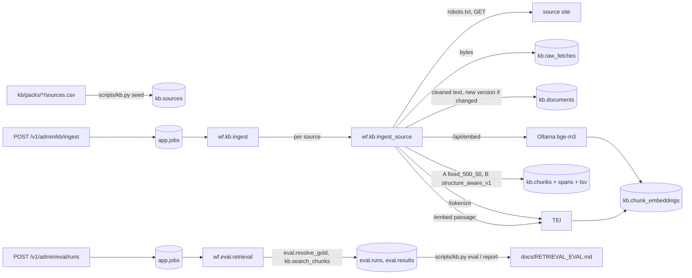
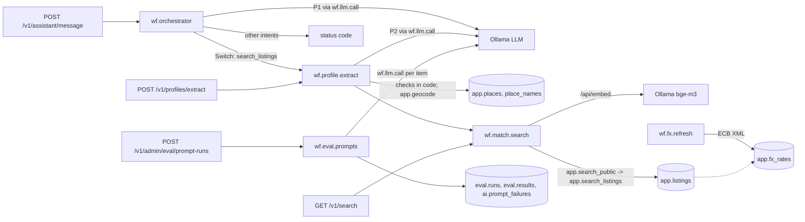

# Architecture (services as of phase 4; request paths as of phase 2)

This file describes what exists. The target architecture is in FLATSHARE_BACKEND_SPEC.md
sections 5 and 8; deviations are in DECISIONS.md.

## Services (docker-compose.yml)

| Service | Role | Reachable from |
|---|---|---|
| `proxy` (Caddy) | Public entry: `/v1/*` → n8n production webhooks; envelopes n8n's own error answers; 1 MiB body limit | host 127.0.0.1:8080 |
| `n8n` + `n8n-runners` | All API logic: gateway, endpoints, error handler. Code nodes run in the external runner | proxy; editor on host 127.0.0.1:5678 |
| `postgres` | One server, two databases: `flatshare` (app, kb, ai, eval, sec schemas) and `n8n` (n8n's own data) | compose network |
| `garage` | S3-compatible object storage (bucket created at start) | compose network |
| `ollama` | Embeddings (bge-m3); the local LLM qwen3.5:4b for P1 to P3 and, with images, P7 (D-081) | compose network |
| `media` (FastAPI) | Photo processing (type, size, EXIF strip, hashes, blurring, metrics), presigned uploads, the smaller copy of a photo for P7 (`/v1/images/vision`), evaluation photos (`/v1/eval/photos`, keys under `eval/` only). Compute only; reads and writes objects, no database (D-070, D-071) | compose network, internal token |
| `text` (FastAPI) | Language identification (GlotLID) and PII masking with optional NER (D-074, D-075) | compose network, internal token |
| `telegram` | Long-polling relay from the Telegram Bot API to n8n's internal webhook (D-079) | outgoing only |
| `tei` (Text Embeddings Inference, CPU) | multilingual-e5-large embeddings and the XLM-RoBERTa tokenizer used for chunking | compose network |
| one-shot: `db-bootstrap`, `n8n-setup`, `ollama-pull` | migrations, role passwords, settings, API keys; credential and workflow import; model pull | — |
| profiles: `queue` (Redis), `test` (test runner, fixture file server) | load tests later; contract and ingestion tests | — |

Not built yet: ASR service (phase 4), video frames and PDF text in the Media service (phase 4), 3D worker (phase 10).

## Request path

Three or four database calls per request, all parameterised. Secrets never pass through n8n:
the HMAC is computed inside PostgreSQL by a function `n8n_worker` can call but whose key table it cannot read.

## Workflows (n8n/workflows, generated by n8n/build.py)

| Workflow | Trigger | Does |
|---|---|---|
| `wf.gateway.auth` | sub-workflow | signature, replay, rate limit, user, role, consent, body rules, idempotency |
| `wf.api.health` | `GET /v1/health` | database, object storage, Ollama + embedding model checks |
| `wf.api.users_sync` | `POST /v1/users/sync` | create/update user, consent status |
| `wf.ops.error_handler` | Error Trigger | records unexpected workflow failures in `ai.executions` |
| `wf.api.admin_kb_ingest` | `POST /v1/admin/kb/ingest` (admin) | creates a `kb_ingest` job, starts `wf.kb.ingest`, answers 202 |
| `wf.kb.ingest` | sub-workflow (job worker) | loads the pack's sources, runs `wf.kb.ingest_source` for each, logs, finishes the job |
| `wf.kb.ingest_source` | sub-workflow | robots.txt, fetch, clean (HTML or PDF), store version, tokenize (TEI), chunk A and B, embed (Ollama, TEI; one request at a time, D-049), store |
| `wf.api.jobs_get` | `GET /v1/jobs/:id` | job status for the requester, admins and moderators |
| `wf.api.admin_eval_runs_create` | `POST /v1/admin/eval/runs` (admin) | creates an `eval_retrieval` job, starts `wf.eval.retrieval`, answers 202 |
| `wf.eval.retrieval` | sub-workflow (job worker) | resolves gold, embeds queries once per model, searches every configuration, stores per-query metrics |
| `wf.api.admin_eval_runs_get` | `GET /v1/admin/eval/runs/:id` (admin) | one run with summary and per-query metrics |
| `wf.llm.call` | sub-workflow | loads a prompt version (`ai.prompt_for`), calls Ollama `/api/chat` with the JSON Schema as `format`, validates, retries once with the errors |
| `wf.orchestrator` | `POST /v1/assistant/message` | A0: P1 router, deterministic Switch; search goes to A2 then A3, other intents answer a status code |
| `wf.profile.extract` | sub-workflow | A2: P2, amounts converted to minor units from P2 v3 (`lib/money.js`, D-066), deterministic checks (allowed preferences, currency), anchor geocoded |
| `wf.match.search` | sub-workflow | A3 (search part): embeds the text query (bge-m3), `app.search_public` |
| `wf.api.search` | `GET /v1/search` | filters, optional text, optional saved profile |
| `wf.api.profiles_extract` | `POST /v1/profiles/extract` | `wf.profile.extract`, optionally saves |
| `wf.api.profiles_me` | `PUT /v1/profiles/me` | validates and saves the profile (`app.save_profile`) |
| `wf.api.admin_eval_prompt_runs_create` | `POST /v1/admin/eval/prompt-runs` (admin) | creates an `eval_prompts` job, starts `wf.eval.prompts` |
| `wf.eval.prompts` | sub-workflow (job worker) | golden set of P1 or P2 for versions x models, one item at a time; results, summaries, `ai.prompt_failures` |
| `wf.api.admin_listings_embed` / `wf.listings.embed` | `POST /v1/admin/listings/embed` (admin) / worker | embeds listings without an embedding, 16 texts per request, one request at a time |
| `wf.api.admin_fx_refresh` / `wf.fx.refresh` | `POST /v1/admin/fx/refresh` (admin) and weekdays 17:10 / worker | ECB reference rates into `app.fx_rates` |
| `wf.test.fail` | `GET /v1/test/fail` | test-only, throws; imported only with `N8N_IMPORT_TEST_WORKFLOWS=1` |

## Database roles

| Role | Used by | Can |
|---|---|---|
| `postgres` | migrations, bootstrap | everything |
| `n8n_app` | n8n itself | owns database `n8n` only |
| `n8n_worker` | workflows (credential "Flatshare DB (n8n_worker)") | CRUD on app/kb/ai/eval, bypasses RLS, calls `sec.verify_request`; cannot read `sec.api_clients` |
| `api_user` | reserved for a future API layer | RLS-limited reads and owner-limited writes; three functions |
| `sec_owner` | owns `sec.*` | no login |

## Knowledge base (phase 2)

Compute stays outside n8n only where n8n cannot do it: tokenization and e5 embeddings (TEI), bge-m3 embeddings (Ollama), search and storage (PostgreSQL functions). Cleaning, structure parsing, chunking and metrics are plain JavaScript in `kb/` and `eval/lib/`, inlined into Code nodes by `n8n/build.py` and unit-tested with `node --test`.

## Profile and search (phase 3)

Every LLM call goes through `wf.llm.call`: the template and schema come from the registry, the model
from `llm.default_model` unless the caller names one. Agent steps (prompt version, model, tokens,
latency, errors; never the request text) are written to `ai.agent_steps` with the request record by
`app.api_finish`. Search, money conversion, geocoding and location fuzzing are PostgreSQL functions
(migration 0008); scoring of prompt outputs is `eval/lib/prompt_metrics.js`, inlined into the worker.

